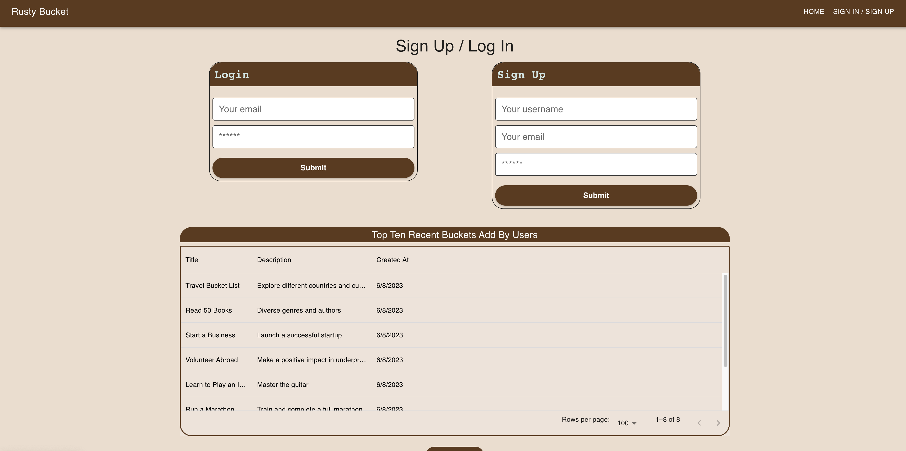
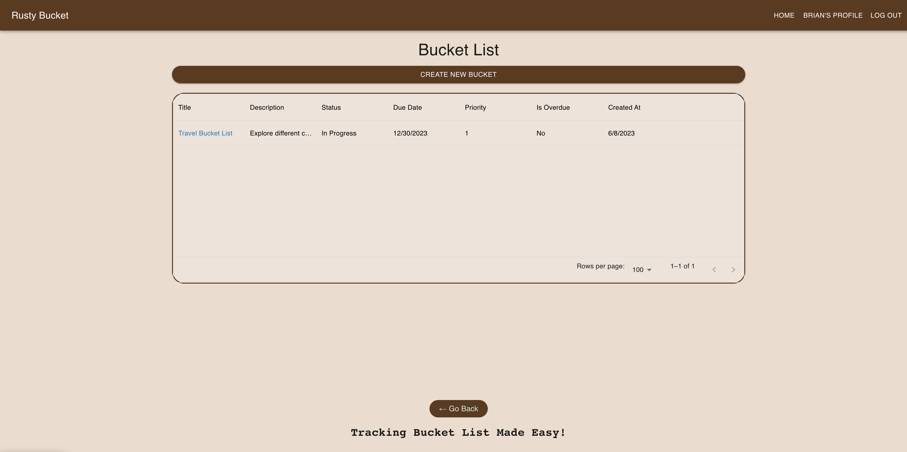
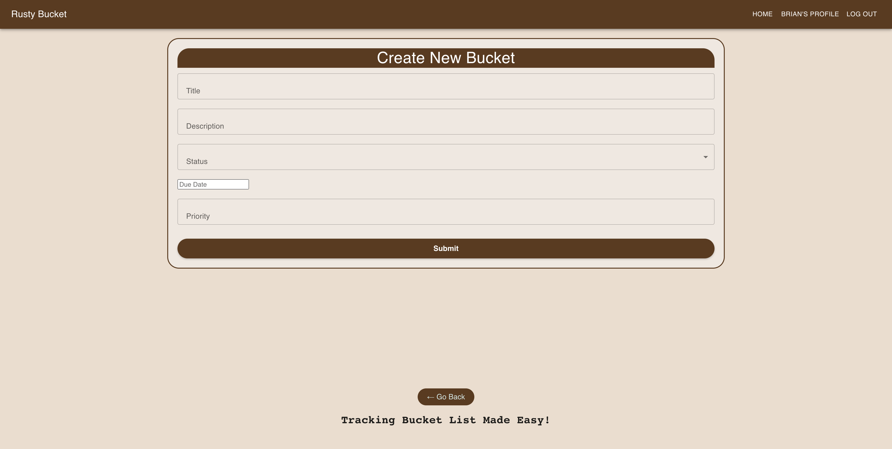
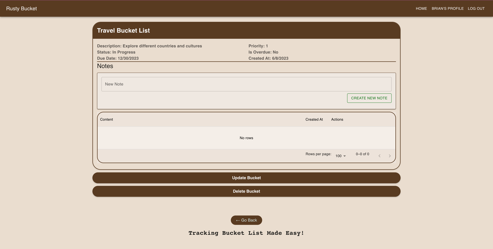
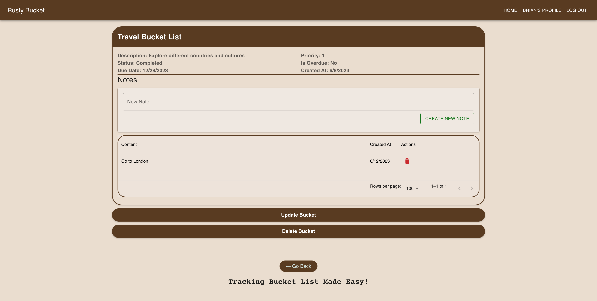
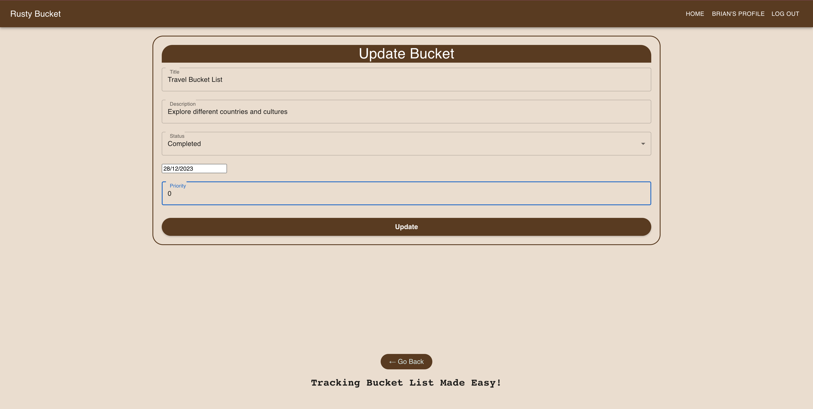

# Rusty-Bucket
[](https://opensource.org/licenses/MIT)
## [Description](#table-of-content)
We create a bucket list application for the travelers of all-ages to collect their thoughts and record what they wanted to do before they miss the opportunities as they grew older.

This application records Travelers' bucket lists, details inside each list, deadlines and priorities.

[Click here for deployed link](https://four-rusty-bucket.herokuapp.com/)

## [Table of Content](#table-of-content)
* [Description](#description)
* [Installation](#installation)
* [Usage](#usage)
* [Authors](#authors)

## [Installation](#table-of-content)
This web application is made with the help of following packages:

Installed Frontend Packages
* [Mui](https://mui.com/material-ui/getting-started/installation/)
* [Emotion React: CSS Library](https://emotion.sh/docs/introduction)

Installed Backend Packages
* [Express.js](https://expressjs.com/)
* [React](https://react.dev/)
* [Mongodb Atlas](https://www.mongodb.com/atlas/database)
* [Graphql](https://graphql.org/)
* [Apollo Server Express](https://www.npmjs.com/package/apollo-server-express)


When executing one of these commands, execute them in project folder.
| Command | Description |
| --- | --- |
|```npm i```|To install the packages as mentioned in the list above|
|```npm run seed```|To plant the seed of data|
|```npm run start```|To run Apollo Sandbox|
|```npm run develop```|To run the application in localhost|


It is deployed in Heroku. [Click here for deployed link](https://four-rusty-bucket.herokuapp.com/)
## [Usage](#table-of-content)
Here is a table of content for the Rusty Bucket pages. You can click any one of them and it will send you to destination.
### [Table-of-content-for-Rusty-Bucket-pages](#table-of-content-for-rusty-bucket-pages)
* [Homepage](#homepage)
* [Login/Signup](#loginsignup)
* [Profile](#profile)
* [Create New Bucket](#create-new-bucket)
* [Bucket Detail](#bucket-detail)
* [Update Bucket](#update-bucket)

### [Homepage](#table-of-content-for-rusty-bucket-pages)
[Click here for deployed link](https://four-rusty-bucket.herokuapp.com/)

When you click on the link of the website, you are greeted with pictures. They are suggestions for you to add in your new bucket list. You are welcome to click any pictures. It will give you many possibilities of what do you want to do.


### [Login/Signup](#table-of-content-for-rusty-bucket-pages)
But before adding anything, you must sign in. Enter your Username, email and a password on your right. Once you are done, you can revisit the website by login in with your email and password. <mark>***Please remember your password because we have not added features where you can change your password if you forget one.***<mark>



### [Profile](#table-of-content-for-rusty-bucket-pages)
The Profile page will appear once you login or sign up. For the first-time users, you will only see empty list. You can click the button labeled "Create New Bucket" to add a new bucket. See this [link](#create-new-bucket) for more instruction on Create New Bucket. Once you submit the form, this is the page where you see all the list you want to do. It contains Title, Brief Description, Status, Due date, Priority, isOverdue, and Create At.



### [Create New Bucket](#table-of-content-for-rusty-bucket-pages)
To create a new task, there is a button on top of the list in the profile page where you can click. Hover your mouse and the button changes color to brighter yellow, that is when you can click. This action will take you to the next page. The new page contains a form where users are allow to create a Title, Description, Status, Due Date, and Priority.



* __Title__: Don't know what to put in the title? Make a category (Make it broad, you can add details later)
* __Description__: Be Specific with what you want to do, where and with anyone?
* __Status__: Three options you can choose from: Not started, In progress, and Complete
* __Due Date__: Pick any day you want to complete
* __Priority__: Scale is from 1-10. The lesser the number, the higher of important or how soon the task must complete.

### [Bucket Detail](#table-of-content-for-rusty-bucket-pages)
When you click on one of title in your bucket list, it will take you to another page where you can see your list in more detail. You can add notes or tasks surrounding the title you created. 



You have the option to delete the note you created by pressing the bin icon button.



If you wish to delete the bucket, click the delete bucket. It will get rid of everything, including the small tasks

### [Update Bucket](#table-of-content)
Above the Delete button, there is an update button for you to edit a Title, Description, Status, Due Date, and Priority. You just have to retype them and then press the update button and you are all set!




## [Authors](#table-of-content)
* Getnet Ali 
* Jean Suwatcharoenchai
* Nhan Tran
* Erin Wallace

[Back to the top](#rusty-bucket)